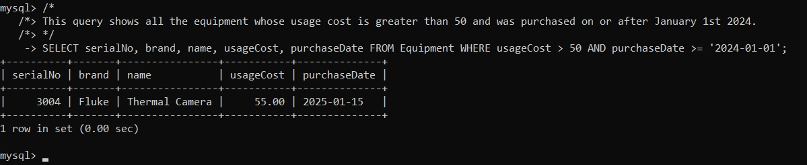
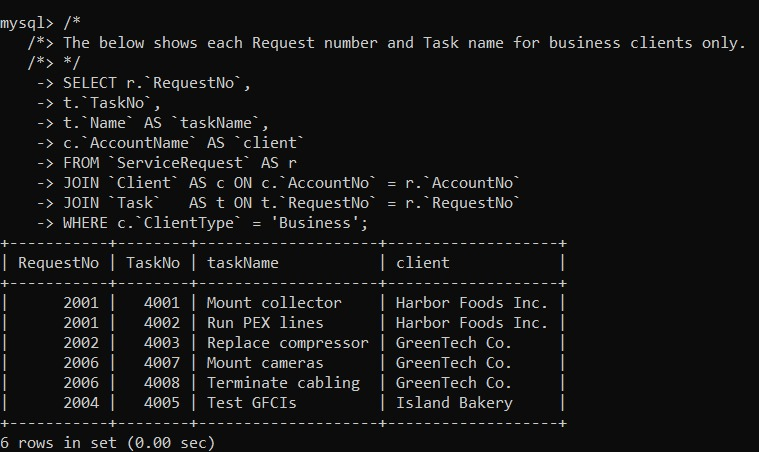
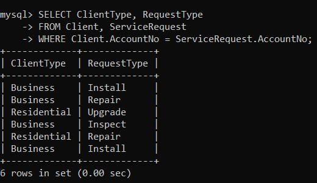

# Reports

Source: `sql/05_reports.sql`  
Evidence: `docs/evidence/`

## Report 01 — Plumbing tasks > 500
- Query: `sql/05_reports.sql` (Report 01)
- Evidence: 

## Report 02 — Equipment usageCost > 50 after 2024-01-01
- Evidence: 

## Report 03 — Business client requests + tasks
- Evidence: 

## Report 04 — ClientType + RequestType
- Evidence: 
